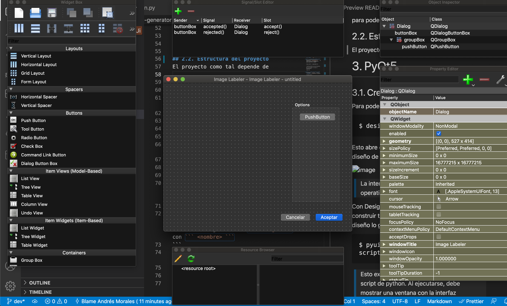

# Actividad 01 | Chessbot 
Tarea de __Acta 02 - 24/02/22__ 

## Tabla de Contenido 
- [Actividad 01 | Chessbot](#actividad-01-chessbot)
  - [Tabla de Contenido](#tabla-de-contenido)
- [Objetivos](#objetivos)
    - [Equipo](#equipo)
  - [QuickStart](#quickstart)
    - [Instalación de Requerimientos](#instalación-de-requerimientos)
    - [Primera Ejecución de prueba](#primera-ejecución-de-prueba)
  - [Estructura del proyecto](#estructura-del-proyecto)
- [PyQt5](#pyqt5)
  - [Crear el diseño](#crear-el-diseño)
  - [Referencias](#referencias)

<hr>

# Objetivos
- Crear una interfaz para el image Labeler 
- Integrar la cámara de la Raspberry

### Equipo 
1. __Encargado:__  Andrés Morales  
2. __Miembros Actuales:__ 


## QuickStart 
Para poder empezar a trabajar en el proyecto, es necesario crear un entorno virtual. En este momento se está usando ``` pyton 3.9.8 ``` con pip ``` pip 22.0.3 ```. Para esto, se usa el módulo de python ```virtualenv``` https://docs.python.org/es/3/library/venv.html 

__Por convención, el entorno se creará con el nombre ``` venv ```__ 

### Instalación de Requerimientos 
En la carpeta este directorio, se encuentra el ```requirements.txt ```. Con _PIP_ se instalan las dependencias espcificadas con el comando: 

```
$ pip install -r requirements.txt
```

_Ejecutado desde este mismo directorio_

Una vez ejecutado, se revisa la instlación con 
```
$ pip list
```

### Primera Ejecución de prueba 
El Documento ``` main.py ``` será el __entrypoint__ de ejecución. Se ejecuta 
```
$ python main.py
```
para poder ver la ventana de la interfaz 


## Estructura del proyecto
El proyecto como tal depende de 

# PyQt5
## Crear el diseño
Para poder crear un diseño, se ejecuta el comando 
```
$ designer  
```

Esto abre el siguiente entorno nativo para el diseño de la __GUI__



> La interfaz puede variar depende el sistema operativo en el que te encuentres. 

Con Designer abierto, puedes comenzar a construir tu interfaz. Una vez completado el diseño lo guardas en ``` designs ``` con ``` <nombre> ```
```
$ pyuic5 -x designs/<nombre> -o scripts_gui/ventana_ui.py
```

> Esto exporta el diseño, y lo convierte en un script de python. Al ejecutarse, debe mostrar una ventana con la interfaz diseñada. 

## Modificar la Lógica del diseño 
Todo cambio que se haga a la interfaz, va a estar en la carpeta ```/gui```. Ahí, está un clase de interfaz, encagarda de mostrar la aplicación.

Se instancia la GUI y se invoca el ```display()``` Para mostrar la ventana. En el método de ```setup()``` se agrega todos los listeners para cada componente. 

## Referencias 
- https://www.riverbankcomputing.com/static/Docs/PyQt5/
- https://build-system.fman.io/pyqt5-tutorial


<br>
<br>
_Traido con <3 por el equipo de Chessbot._


